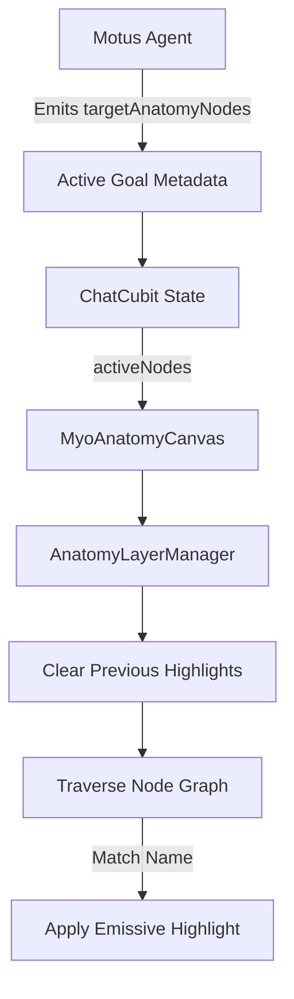

# 3D Digital Twin & Anatomical Visualization

## Overview
Phase 2 of MyoTwin integrates a multi-layered, interactive 3D anatomy model directly into the HUD background. Powered by the native Impeller-based `flutter_scene` engine, the Digital Twin provides real-time visual feedback for biological state and AI-driven heatmap targeting.

---

## Architecture

### 1. `AnatomyLayerManager`
The central orchestrator for the 3D scene lifecycle.
- **Asynchronous Loading**: Loads the 6 multi-megabyte GLB assets in parallel to prevent UI thread stutter.
- **Hierarchical Traversal**: Automatically walks the 3D node tree to apply materials and locate target segments.
- **System Management**: Maintains references to individual system roots (Skeletal, Muscular, Nervous, etc.) for independent visibility control.

### 2. Tactical PBR Shaders
Instead of static textures, MyoTwin uses procedural **Physically Based Rendering (PBR)** materials to maintain a high-contrast, tactical aesthetic:
- **Base Material**: A high-metallic (0.9), dark-grey finish that catches rim lights to define anatomical volume.
- **Ghost Material (X-Ray)**: A transparent blend mode with 20% opacity white, used to reveal underlying systems (e.g., seeing bones through muscles).
- **Heatmap Material**: A high-intensity emissive shader used to highlight specific nodes in response to AI context.

---

## Viewport & Interaction
The **`MyoAnatomyCanvas`** provides an immersive, cross-platform interaction model.

### Interaction Controls
| Gesture | Mobile Action | Desktop Action |
| :--- | :--- | :--- |
| **Orbit** | 1-Finger Drag | Left-Click + Drag |
| **Pan (Omni)** | 2-Finger Drag | Shift + Click + Drag |
| **Zoom** | 2-Finger Pinch | Mouse Wheel / Scroll |
| **Reset** | Long-press Grid | Long-press Grid |

### Silhouette Hit-Testing
To support the "tap off" reset behavior, the canvas implements a **Silhouette Heuristic**.
- **Model Hits**: Taps in the central 50% of the screen are captured for model interaction (orbiting).
- **Background Hits**: Taps in the peripheral empty space "pass through" to the interactive grid background. This allows background-specific gestures (like the Glitch Reset) to fire without interference from the 3D model.

### Cinematic Glitch-Masked Reset
When a user long-presses the background, the HUD triggers a high-severity **`HoloGlitch`** spike. At the peak of the visual noise (150ms), the camera and grid snap instantly to their default framing, making the transition feel like a hardware re-calibration.

---

## AI & Heatmap Integration
The 3D model is reactively bound to the **`ChatCubit`** state.

### Automated Targeting
Whenever the AI identifies relevant body parts (e.g., `Biceps_L`) in the current context, the `AnatomyLayerManager` recursively searches the 3D node tree for that string. The matching mesh is then re-assigned a glowing emissive material in the 3D scene, visually connecting the AI's intelligence with the physical digital twin.
 Greenland
