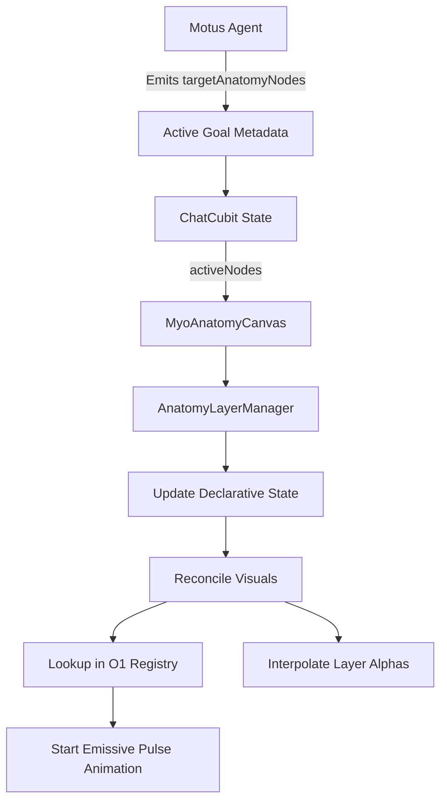

# 3D Digital Twin & Anatomical Visualization

## Overview
Phase 2 of MyoTwin integrates a multi-layered, interactive 3D anatomy model directly into the HUD background. Powered by the native Impeller-based `flutter_scene` engine, the Digital Twin provides real-time visual feedback for biological state and AI-driven heatmap targeting.

---

## Architecture

### 1. `AnatomyLayerManager`
The central orchestrator for the 3D scene lifecycle, implemented as an animated `ChangeNotifier`.
- **Asynchronous Loading**: Loads the 6 multi-megabyte GLB assets in parallel to prevent UI thread stutter.
- **Indexed Registry**: Builds a `Map<String, List<Node>>` during load for $O(1)$ lookup performance when highlighting specific nodes.
- **Declarative Reconciliation**: Manages visual state via a single `reconcile()` path, ensuring isolation and highlights never conflict.
- **Animated Transitions**: Uses internal `AnimationController`s to drive smooth PBR property fades and rhythmic highlight pulses.

### 2. Tactical PBR Shaders
MyoTwin uses 6 unique **Physically Based Rendering (PBR)** materials (one per layer) to allow independent, synchronized animations:
- **Solid Material**: Used for the isolated system (90% alpha for a holographic feel).
- **Muscular Material**: A specialized isolated state (60% alpha) that allows X-ray visibility into deeper muscle layers and the skeleton.
- **Ghost Material**: A low-opacity (10%) blend mode used for non-isolated systems to provide anatomical context.
- **Pulsing Highlight Material**: A high-intensity emissive shader with a 1.5s rhythmic pulse, assigned to nodes matching the current AI context.

---

## Viewport & Interaction
The **`MyoAnatomyCanvas`** provides an immersive, cross-platform interaction model.

### Interaction Controls
| Gesture | Mobile Action | Desktop Action |
| :--- | :--- | :--- |
| **Orbit** | 1-Finger Drag | Left-Click + Drag |
| **Pan (Omni)** | 2-Finger Drag | Shift + Click + Drag |
| **Zoom** | 2-Finger Pinch | Mouse Wheel / Scroll |
| **Reset** | Long-press Grid | Long-press Grid |

### Silhouette Hit-Testing
To support the "tap off" reset behavior, the canvas implements a **Silhouette Heuristic**.
- **Model Hits**: Taps in the central 50% of the screen are captured for model interaction (orbiting).
- **Background Hits**: Taps in the peripheral empty space "pass through" to the interactive grid background. This allows background-specific gestures (like the Glitch Reset) to fire without interference from the 3D model.

### Cinematic Glitch-Masked Reset
When a user long-presses the background, the HUD triggers a high-severity **`HoloGlitch`** spike. At the peak of the visual noise (150ms), the camera and grid snap instantly to their default framing, making the transition feel like a hardware re-calibration.

---

## AI & Heatmap Integration
The 3D model is reactively bound to the **`ChatCubit`** state.

### Automated Targeting
Whenever the AI identifies relevant body parts (e.g., `Biceps_L`), the `AnatomyLayerManager` instantly retrieves the nodes from its **Indexed Registry**. These nodes are temporarily re-assigned to the **Pulsing Highlight Material**, creating a rhythmic glow that draws the user's eye to the biomechanical focus point.
