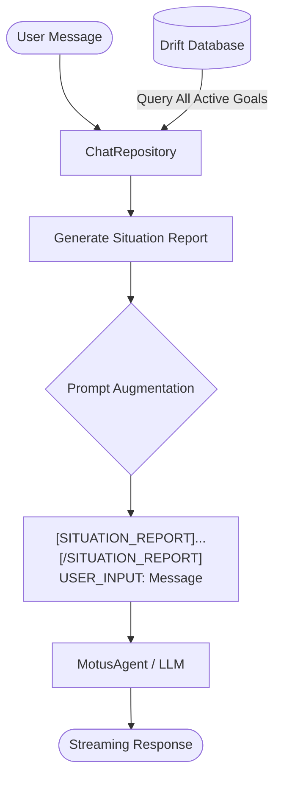
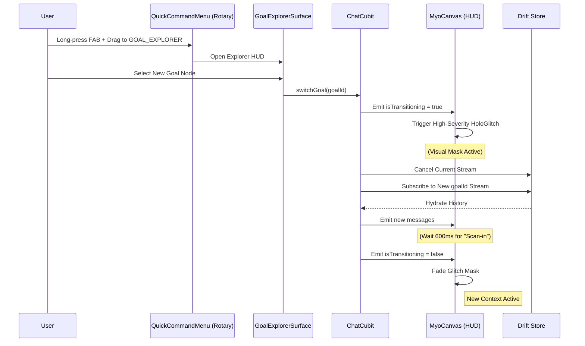

# Biomechanical Intelligence & Multi-Goal Context

## Overview
MyoTwin evolves the traditional "chatbot" model into a **Biomechanical Intelligence** by maintaining global awareness of the user's biological objectives. Instead of isolated chat histories, every interaction is grounded in a "Situation Report" that considers all active goals and their target anatomical nodes (the Kinetic Chain).

## The Domain Model
Goals are stored in the Drift database but utilize **Extension Types** in `shared_core` to provide semantic meaning to unstructured JSONB metadata.

### `GoalMetadata`
- **`summary`**: A concise brief of the goal for AI digestion.
- **`targetAnatomyNodes`**: A list of unique identifiers for physical body parts (e.g., `["shoulder_l", "scapula_l"]`).
- **`relatedGoalIds`**: Explicit semantic links between objectives.

---

## Context Injection Pipeline
When a user sends a message, the `ChatRepository` augments the prompt before it reaches the `MotusAgent` (LLM).

The **Situation Report** ensures the AI knows, for example, that if you are training "Bench Press", you also have an active "Shoulder Recovery" goal, allowing it to provide safety-first coaching.

---

## Cinematic Context Switching
To prevent UI "whiplash" when switching between different goal histories, MyoTwin uses a hardware-inspired cinematic transition.

### UI Interaction Components
- **`QuickCommandMenu`**: A high-fidelity rotary dial anchored to the FAB with seamless "Stem and Bloom" animations.
- **`GoalExplorerSurface`**: A searchable, filterable HUD overlay for navigating the Knowledge Graph.
- **`HoloGlitch`**: A post-processing shader used to mask the data swap, making it feel like a hardware protocol shift.
- **`HolographicDecryptText`**: Used in the tooltips and chat to "scan in" semantic labels during transitions.
