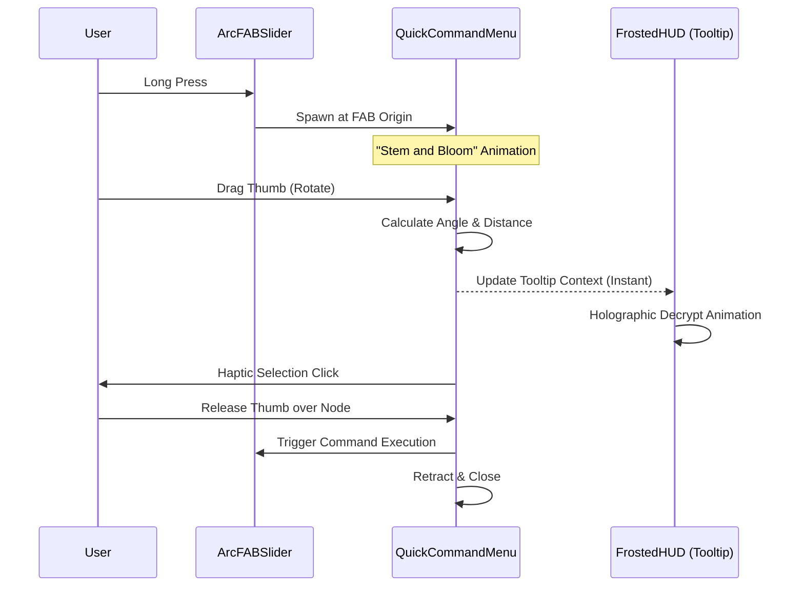

# Interactive GenUI Model & Tactical HUD Interaction

## Overview
The MyoTwin interface moves away from traditional flat UI components in favor of a **Hardware-Inspired Tactical HUD**. This model prioritizes one-handed, gesture-driven interactions that feel mechanical and high-fidelity, utilizing post-processing shaders and complex spatial math to create an immersive experience.

---

## The ArcFABSlider (Input Mode Orchestrator)
The central interaction node of the HUD is the **ArcFABSlider**. Unlike a standard Floating Action Button, it exists on a parabolic arc track.

### Mechanics:
- **Arc Geometry**: As the FAB moves horizontally (Left for `Voice`, Right for `Text`), it drops vertically along a parabolic path (`y = x² * dropDistance`). This ensures the user's thumb has a natural rotational movement.
- **Dynamic Scaling**: The FAB scales down proportionally as it moves away from the center to provide a sense of depth and focus.
- **Flick Prediction**: The slider uses velocity-based prediction. A quick flick toward a side snaps it instantly to that mode, accompanied by heavy haptic feedback for a mechanical "thunk" feel.

---

## The QuickCommandMenu (Rotary Interaction)
Triggered by a **Long Press** on the FAB, the **QuickCommandMenu** provides rapid access to high-level commands (e.g., Goal Explorer, Logs, Diagnostic).

### Advanced Rotary Logic:
- **Dynamic Origin Anchoring**: The menu center perfectly follows the physical location of the FAB as it slides.
- **Angular Sector Hit-Testing**: To ensure precise selection at a tight 40px radius, the menu uses **Angular Detection** instead of point-based hit boxes. If the thumb angle aligns with a node's sector (within a 15px to 130px distance ring), the node highlights.
- **Even Distribution**: The menu calculates strict angular boundaries based on the FAB's position:
    - **Center**: $150^\circ$ to $30^\circ$ (Top Arc).
    - **Left Snapped**: $150^\circ$ to $0^\circ$ (Top-Right Fan).
    - **Right Snapped**: $180^\circ$ to $30^\circ$ (Top-Left Fan).

---

## FrostedHUD & Dynamic Tooltips
The **FrostedHUD** provides a "glassmorphic" container for complex UI surfaces (like the Goal Explorer) and tooltips.

### Key Implementation Details:
- **Shader-Aware Clipping**: Utilizing the **`BleedMargin`** widget, the HUD allows its `HoloGlitch` post-processing shader to warp content slightly beyond its layout bounds without being hard-clipped by parent widgets.
- **Context-Aware Tooltips**: Tooltips automatically reposition based on the menu's location on the screen (Center, Left, or Right) to ensure they are never obscured by the user's hand.
- **Holographic Reveal**: Tooltips utilize the `HolographicDecryptText` widget to "scan in" command labels as the user's thumb moves between sectors.

---

## Interaction Lifecycle

