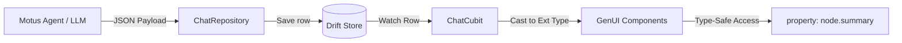

# Unstructured Intelligence Data Strategy

## Overview
MyoTwin utilizes an **Unstructured Data Strategy** to manage rapidly evolving AI payloads without the friction of traditional SQL schema migrations. By combining **SQLite JSONB** storage with **Dart 3.3 Extension Types**, we achieve a "Zero-Cost Wrapper" architecture that is both highly flexible and strictly type-safe.

---

## Storage: Drift & JSONB
All core AI-driven entities (`Goal`, `IntentRecord`) store their primary logic in unstructured `metadata` or `payload` columns.

- **Persistence Layer**: Drift (SQLite) stores these fields as text-based JSON (or binary JSONB).
- **Type Conversion**: Custom `TypeConverter` classes in the infrastructure layer handle the automatic serialization/deserialization between raw JSON strings and Dart `Map<String, dynamic>` objects.
- **Zero Migrations**: New features (like adding anatomical kinetic chain nodes or symptom severity ratings) can be added to the AI's output instantly. The database layer remains unchanged, avoiding costly and risky migration scripts.

---

## Interface: Dart 3.3 Extension Types
To avoid the overhead of allocating new object wrappers for every database row, MyoTwin utilizes **Extension Types**.

### The "Zero-Cost Wrapper" Pattern:
Extension types provide a static, type-safe interface over an underlying map without any runtime performance penalty.

```dart
// Example: GoalMetadata Extension Type
extension type const GoalMetadata(Map<String, dynamic> data) {
  String? get summary => data['summary'] as String?;
  List<String> get targetAnatomyNodes => 
      (data['anatomy_nodes'] as List?)?.cast<String>() ?? const [];
}
```

### Benefits:
1. **Performance**: No new objects are created when wrapping a map. It is a compile-time only abstraction.
2. **Type Safety**: Developers interact with named properties (`meta.summary`) instead of fragile string keys (`meta.data['summary']`).
3. **Semantic Clarity**: The domain model remains clean while allowing the underlying JSON to evolve freely.

---

## Data Lifecycle
The following diagram illustrates how raw AI output is transformed into a type-safe interactive surface.


---

## Summary of Entities
| Entity | JSON Wrapper | Purpose |
| :--- | :--- | :--- |
| `Goal` | `GoalMetadata` | Kinetic chain linking, status, and AI summaries. |
| `IntentRecord` | `IntentPayload` | GenUI configuration, action triggers, and session results. |
| `Notification` | `NotifyMetadata` | Urgency levels, routing paths, and deep links. |
